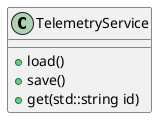

## Telemetry Service

> iRacing stores telemetry files in `$env:HOME/Documents/iRacing/telemetry`

The `TelemetryService` is responsible from cataloging all of the available iRacing telemetry files.  

