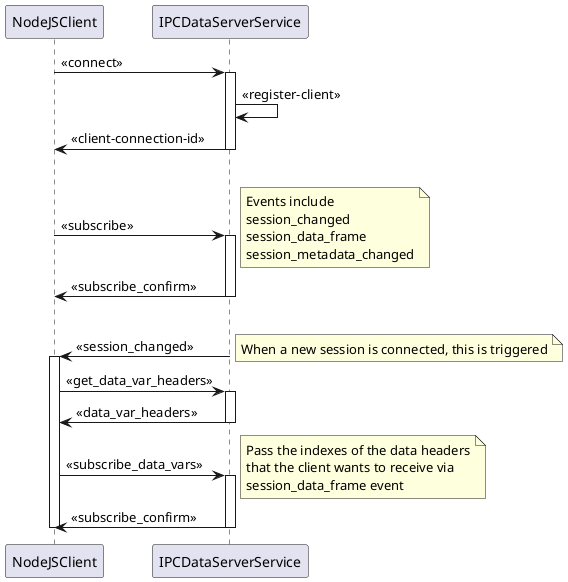

# `IPCDataServerService` Design

## Todo

- Events
  - Add connection event `publish` emit code for all events
- Connection Management
  - Track connections
- Request/Response Messages
  - `IsConnected`
  - `GetVariableHeaders`
  - `GetSessionInfo`
  - `Subscribe(DATA_FRAME|SESSION_INFO)`

